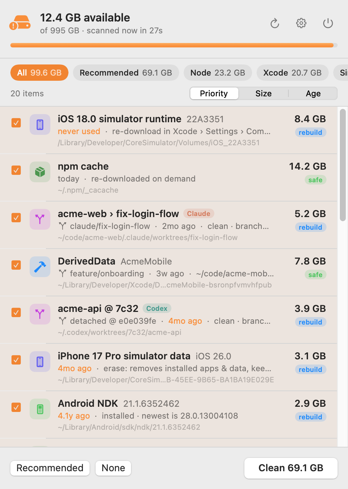

<p align="center">
  
</p>

<h1 align="center">SpaceGuard</h1>

<p align="center">
  A tiny macOS menu-bar app that watches your free disk space. When it runs low, SpaceGuard finds<br>
  the gigabytes your dev tools and coding agents left behind and offers to clean them up.
</p>

<p align="center">
  <picture>
    <source media="(prefers-color-scheme: dark)" srcset="docs/screenshot-dark.png">
    
  </picture>
</p>

## Why

Xcode, simulators, Gradle, npm and friends quietly eat hundreds of gigabytes. Coding agents add to
it: Claude Code, Codex, Cursor and Conductor spin up git worktrees, each with its own
`node_modules` and build folders, and rarely clean them up.

SpaceGuard finds all of it. For each item it shows which project, branch and agent it came from and
how long it has sat untouched. The list is ranked so the big, stale, safe-to-delete items come first.

## Features

- **Watches free space from the menu bar.** The menu bar shows how much space is left, like `117GB`,
  in orange, then red, as the disk fills. When space drops below your threshold, you get a
  notification saying how much can be reclaimed.
- **Knows where dev junk lives.** It covers 100+ cache locations and build-artifact types across
  Xcode, simulators, Android, Node, Python, Rust, Go, JVM, Ruby, Flutter, Homebrew, Docker, editors
  and AI tools, plus the build output inside your own projects.
- **Understands worktrees.** It finds every linked worktree of every repo, including the ones agents
  keep in hidden folders, and shows its branch and agent. It runs `git status` on each: worktrees
  with uncommitted work are flagged and never preselected. Removing a worktree always keeps its branch.
- **Ranks by size × staleness × safety.** Every item is labeled **safe** (a pure cache),
  **rebuild** (comes back after a reinstall, rebuild or re-download) or **review** (may hold state
  you care about).
- **Fast.** One `getattrlistbulk` syscall reads a whole directory, running on a shared thread pool.
  Sizes match `du -sk` exactly and are measured about 6× faster. Automatic rescans are incremental,
  and results fill in as they're measured.
- **Light.** It's a ~2 MB native Swift/SwiftUI app with no dependencies, using 20–40 MB of RAM. When
  idle, it only checks free space once a minute.
- **Private.** No network access and no analytics. It reads file metadata and nothing leaves your Mac.

## What it finds

| Area | Items |
| --- | --- |
| Worktrees | Linked worktrees of every repo found, including `.claude/worktrees`, `~/.codex/worktrees`, `~/.cursor/worktrees`, Conductor workspaces and temp folders. Also agent worktree folders git no longer tracks |
| Project build output | `node_modules`, `.next`, `.turbo`, `.expo`, AWS `cdk.out`/SAM/Serverless, Rust `target/`, Gradle `build/` + `.gradle`, `Pods/`, SwiftPM `.build/`, Xcode `build/`, Flutter `build/` + `.dart_tool`, Python virtualenvs, Terraform, Unity `Library/`, … |
| Xcode | DerivedData per project, linked to its workspace, with orphans detected. Archives, device support, previews, the documentation cache, SwiftPM/CocoaPods/Carthage caches, the Clang module cache |
| Simulators | Runtimes from `simctl`, with "never used" detection. Simulator data (erased, not deleted), unavailable and orphaned devices, test-runner clones, caches, logs |
| Android | Gradle caches, distributions and JDKs, NDKs, build-tools, platforms, system images (flags ones no emulator uses), emulators, old Android Studio caches and settings |
| Node | npm/npx, Yarn (v1 + Berry), pnpm store (hard-link aware), Bun, Deno, nvm/volta/fnm Node versions, Playwright/Puppeteer/Cypress browsers, Electron, node-gyp, Metro and Jest temp files |
| Other toolchains | pip, uv, Poetry, conda, pyenv, rbenv, rustup, Cargo, Go build and module caches, Maven, Ivy, sbt, Coursier, NuGet, Dart pub, Homebrew downloads and old versions, Docker |
| AI tools | Old Claude Code versions, Claude Code session temp folders, Claude simulator builds and VM bundle, Codex caches and runtimes, Hugging Face/Ollama/LM Studio models (review only) |
| Editors & apps | VS Code, Cursor, Windsurf and Claude app caches, workspace storage, JetBrains caches, and every other folder in `~/Library/Caches` and `~/.cache` |

## Install

**[⬇ Download SpaceGuard.dmg](https://github.com/mkrn/spaceguard/releases/latest/download/SpaceGuard.dmg)**
It runs on macOS 14 or later, on Apple silicon or Intel.

Open the DMG, drag SpaceGuard into Applications and launch it. Your free space, like `117GB`, appears
in the menu bar; click it to open the panel. The app is signed with a Developer ID and notarized by Apple, so it opens without Gatekeeper warnings.
To keep it running, turn on **Launch at login** in the gear menu.

### Build from source

Requires Xcode 15 or later (or a Swift 5.9+ toolchain).

```bash
git clone https://github.com/mkrn/spaceguard.git
cd spaceguard
./build.sh --install
```

This builds a release binary, wraps it into `SpaceGuard.app`, signs it, copies it to
`/Applications` (or `~/Applications`) and launches it.

> [!NOTE]
> macOS refuses notification permission to ad-hoc-signed apps. `build.sh` therefore signs with the
> first "Apple Development" identity in your keychain. A free Apple developer account gets you one
> through Xcode › Settings › Accounts. Set `SIGN_IDENTITY` to pick a different one. Without an
> identity everything still works except notifications.

## Releasing

`./release.sh --publish` builds a universal (Apple silicon + Intel) app, signs it with a Developer ID
certificate, notarizes and staples both the app and a DMG, checks them with Gatekeeper, and publishes
a GitHub release. The one-time setup (certificate + `notarytool` credentials) is described at the top
of [`release.sh`](release.sh).

## How it decides

- **Age** is the latest of: file modification times inside the item, git activity for projects and
  worktrees (HEAD, index and reflog), and `simctl`'s `lastUsedAt` / `lastBootedAt`. For DerivedData
  it also uses Xcode's `LastAccessedDate`.
- **Priority** is size, weighted by staleness and safety. Global download caches (npm, Yarn,
  Gradle, CocoaPods…) count as stale whatever their age: a fresh npm cache is just as disposable.
- **Recommended** (preselected) means:
  - download caches,
  - other **safe** items untouched for 2+ days,
  - **rebuild** items untouched for 3+ weeks.
- **Never preselected**:
  - **review** items,
  - the version in use (nvm default, newest NDK, active Claude Code, a booted simulator),
  - anything inside a backup folder,
  - worktrees with uncommitted changes or commits that aren't on any branch.

## How it deletes

- Folders are first renamed into `~/Library/Caches/SpaceGuard/Trash`, which is instant, then erased
  in the background. Read-only trees such as the Go module cache are handled. **Deletion is
  permanent: nothing goes to the Trash.**
- For worktrees, the folder is removed and then `git worktree prune` runs. The branch stays.
- Some items are handed to their own tool:
  - simulator runtimes and devices → `xcrun simctl`
  - old Homebrew versions → `brew cleanup`
  - Docker → `docker system prune -af`
- Guard rails: SpaceGuard never deletes anything outside your home folder and temp folders. It never
  deletes a main git repository. It never deletes top-level or shared folders such as
  `~/Library/Caches` itself.

## Command line

The same binary has headless modes, which are handy for scripting and testing:

```bash
.build/release/SpaceGuard --scan [--incremental] [--json]   # ranked list of everything found
.build/release/SpaceGuard --size <path>...                  # measure folders, like du
.build/release/SpaceGuard --self-test "$(mktemp -d)"        # deletion tests on throwaway fixtures
.build/release/SpaceGuard --snapshot out.png [--dark] [--demo] [--settings]   # render the panel
```

## Performance

These numbers are from a Mac with about 9 million files in dev caches and projects:

- **Full scan:** 72 s.
- **Incremental rescan:** 27 s. Trees that were quiet for 3+ days and look untouched reuse their
  last size.
- Sizes match `du -sk` to the KiB.
- **Save & open:** the last scan is saved, so the panel opens with results immediately, even right
  after launch.

## Contributing

Issues and pull requests are welcome, especially new cache locations and artifact rules. They live in
[`Providers.swift`](Sources/SpaceGuard/Providers.swift) and
[`Discovery.swift`](Sources/SpaceGuard/Discovery.swift). If you change anything that deletes, run
`--self-test` before opening a PR.

## License

[MIT](LICENSE)
